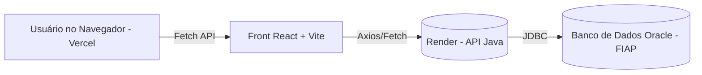

# HC Saúde Digital — Sprint 04

## 📌 Descrição do Projeto

# 🩺 Saúde Digital – Sprint 4 (FIAP)

Projeto desenvolvido durante a **Sprint 4** da disciplina **Front-End Design Engineering** do curso de **Análise e Desenvolvimento de Sistemas – FIAP**.

A aplicação **Saúde Digital** visa auxiliar **pacientes com dificuldades tecnológicas** a acessarem **suporte técnico** e **consultas médicas online**.  
O projeto foi dividido em **duas partes integradas** e a API foi direcionada a aba **Preciso de ajuda** em que o usuário tem acesso a um formulário de contato direto com a plataforma, com isso fizemos a seguinte integração:
- **Back-end (API Java no Render)**  
- **Front-end (React + Vite + TypeScript no Vercel)**
- **Banco de dados (Oracle SQL Developer)**

---

## 🚀 Deploys Públicos

- **Front-end (Vercel):**  
  🔗 [https://challenge-sprint4-s4bm.vercel.app](https://challenge-sprint4-s4bm.vercel.app)

- **Back-end (Render):**  
  🔗 [https://java-sprint4-jjbu.onrender.com/api/solicitacoes](https://java-sprint4-jjbu.onrender.com/api/solicitacoes)

> O front consome diretamente a API hospedada no Render.

---

## 🧩 Arquitetura da Solução



- **Front-end:** Interface web responsiva para registrar e visualizar solicitações.
- **Back-end:** API REST em Java 21 com Maven e Docker, hospedada no Render.
- **Banco de dados:** Oracle Cloud (FIAP), armazenando as solicitações de suporte.

---

## ⚙️ Tecnologias Utilizadas

### **Front-end**
- React + Vite + TypeScript  
- TailwindCSS (estilização 100%)  
- React Router DOM  
- Fetch API para integração  
- Responsividade (breakpoints `sm`, `md`, `lg`, `xl`)  
- Acessibilidade (contraste, legibilidade, botões grandes)

### **Back-end**
- Java 21  
- Maven  
- Oracle JDBC (ojdbc11)  
- HTTP Server nativo (`com.sun.net.httpserver.HttpServer`)  
- Docker + Render (deploy)  
- Integração com Oracle FIAP  
- Suporte a variáveis de ambiente (`DB_USER`, `DB_PASS`)

---

## 🧠 Funcionalidades

### 🩺 **No Front-end**
| Tela | Funcionalidade | Método HTTP |
|------|----------------|-------------|
| `/preciso-ajuda` | Exibir e cadastrar solicitações de suporte | `GET` / `POST` |
| `/gerenciar` | Atualizar status das solicitações | `PUT` |
| `/admin` | Excluir solicitações | `DELETE` |
| `/` | Página inicial e informações do projeto | — |

### ⚙️ **Na API Java**
| Endpoint | Descrição | Método |
|-----------|------------|---------|
| `/api/solicitacoes` | Lista todas as solicitações | `GET` |
| `/api/solicitacoes/{id}` | Busca por ID | `GET` |
| `/api/solicitacoes` | Cria nova solicitação | `POST` |
| `/api/solicitacoes/{id}` | Atualiza status | `PUT` |
| `/api/solicitacoes/{id}` | Exclui solicitação | `DELETE` |
| `/api/solicitacoes/abertas` | Lista apenas as em andamento | `GET` |

---

## 🔄 Integração Front ↔ Back

O arquivo `.env` define o endpoint da API Java:

```bash
VITE_API_URL_JAVA=https://java-sprint4-jjbu.onrender.com
```

No código React:
```ts
const apiUrl = import.meta.env.VITE_API_URL_JAVA;

fetch(`${apiUrl}/api/solicitacoes`)
  .then(res => res.json())
  .then(data => setSolicitacoes(data))
  .catch(() => alert("Erro ao conectar com a API Java"));
```

### 🧱 Tratamento de Erros
- Se a API estiver fora do ar, uma mensagem amigável é exibida.  
- Os botões “Atualizar Status” e “Excluir” retornam feedback visual imediato.  
- A página `/preciso-ajuda` continua funcional mesmo sem resposta do servidor (modo fallback).

---

### 🧱 Deploy no Render
1. Criação do serviço via **Dockerfile**.  
2. Configuração de variáveis de ambiente.  
3. Porta exposta: **8080**.  
4. Teste de endpoint:  
   - https://java-sprint4-jjbu.onrender.com/api/solicitacoes ✅  

---
---
## 🧩 Componentização e Reuso

* **UI Components**

  * `Button` (variações *solid* / *ghost*)
  * `Card`, `Grid`, `Tabs`
  * `ChecklistItem`, `FAQItem`, `FormField`, `MemberCard`

* **Layout Components**

  * `Navbar`, `Footer`, `Layout`, `PageTitle`, `ErrorBoundary`

👉 Benefícios: **responsabilidades isoladas**, **tipagem forte com TypeScript**, **reuso amplo** e **facilidade de manutenção/evolução**.

---

## ⚙️ Tecnologias Utilizadas

* **Frontend:** React 18, Vite 5, TypeScript 5
* **Estilização:** TailwindCSS 3
* **Roteamento:** React Router 6
* **Formulários:** React Hook Form
* **Controle de versão:** Git/GitHub (Git Flow)

---

## 🧪 Hooks, Props e Rotas (Rubrica)

* **useState:** estados locais (ex.: checklist, feedback de contato)
* **useEffect:** persistência em `localStorage` + acessibilidade
* **useNavigate:** navegação programática (Home → Galeria; Checklist → Como Acessar)
* **useParams:** rotas dinâmicas (`/integrantes/:rm`)
* **Props Tipadas:** interfaces em todos os componentes UI
* **Rotas:** estáticas e dinâmicas, conforme tabela

---

## 🎨 Estilização e Responsividade

* **100% TailwindCSS** (`@layer components` + utilitários JSX)
* **Breakpoints:** `sm`, `md`, `lg`, `xl`
* **Acessibilidade (A11y):** foco visível, atributos `aria-*`, contraste adequado e semântica HTML

---

## 🧰 Scripts úteis

```bash
# Instalar dependências
npm install

# Rodar localmente
npm run dev

# Build de produção
npm run build
```

---

## 🧪 Testes e Validações

- Todos os endpoints da API testados via **Postman** e **browser**.  
- Teste de deploy e fetch cross-domain realizado com sucesso no **Vercel + Render**.  
- Verificação de resposta JSON (200, 201, 404, 500) e CORS liberado.

---

## 🎥 Demonstração em Vídeo

🔗 https://www.youtube.com/watch?v=lf-FotaPpOQ

---

## 👥 Integrantes

* Pedro Henrique Costa — RM: 559932 — Turma: 1TDSPV
* Júlia Kauane Menezes — RM: 565568 — Turma: 1TDSPV

---

## 🗂️ Estrutura de Pastas

```bash
.
├── public/
│   ├── icons/
│   ├── imgs/
│   │   ├── hc-05.png
│   │   ├── hc.png
│   │   ├── julia.jiff
│   │   └── pedro.jpg
│   └── videos/
│       ├── Cópia de Acesso ao Portal.mp4
│       └── Cópia de PRIMEIRO ACESSO.mp4
├── src/
│   ├── api/
│   │   ├── solicitacoes.ts
│   ├── components/
│   │   ├── ui/
│   │   │   ├── Button.tsx
│   │   │   ├── Card.tsx
│   │   │   ├── ChecklistItem.tsx
│   │   │   ├── FAQItem.tsx
│   │   │   ├── FormField.tsx
│   │   │   ├── Grid.tsx
│   │   │   ├── MemberCard.tsx
│   │   │   └── Tabs.tsx
│   │   ├── AcessibilityBar.tsx
│   │   ├── ContactForm.tsx
│   │   ├── ErrorBoundary.tsx
│   │   ├── Footer.tsx
│   │   ├── Layout.tsx
│   │   ├── Navbar.tsx
│   │   └── PageTitle.tsx
│   │   └── ReadPage.tsx
│   ├── pages/
│   │   ├── Ajuda.tsx
│   │   ├── AjudaDireta.tsx
│   │   ├── Checklist.tsx
│   │   ├── ComoAcessar.tsx
│   │   ├── Contato.tsx
│   │   ├── FAQ.tsx
│   │   ├── Galeria.tsx
│   │   ├── Home.tsx
│   │   ├── Integrantes.tsx
│   │   ├── MemberDetail.tsx
│   │   └── NotFound.tsx
│   │   └── Sobre.tsx
│   ├── routes/
│   │   ├── AppRoutes.tsx
│   │   └── App.tsx
│   ├── index.css
│   ├── main.tsx
│   └── App.tsx
├── CHANGELOG.md
├── CONTRIBUTING.md
├── index.html
├── package.json
├── package-lock.json
├── postcss.config.js
├── tailwind.config.ts
├── tsconfig.json
├── vite.config.ts
└── README.md
```

---

## 🌿 Fluxo de Versionamento (Git Flow)

* **Branches:**

  * `main` → produção
  * `develop` → integração
  * `feature/*` → novas features

---

## 🛡️ Licença

Projeto acadêmico — uso exclusivamente **educacional**.

* **Link Repositório Github:**

[https://github.com/challenge32/challenge-sprint3](https://github.com/challenge32/challenge-sprint3?tab=readme-ov-file)

https://github.com/challenge32/challenge-sprint3?tab=readme-ov-file

* **Link convite Organizations Github:**

https://github.com/challenge32/challenge-sprint3/invitations

© 2025 - FIAP | Hospital das Clínicas | Projeto Saúde Digital
---
